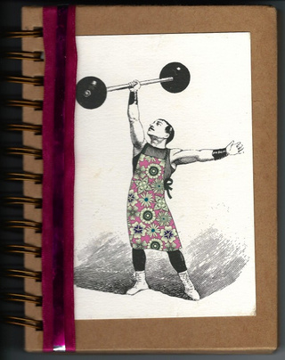

Title: 7 ways to use dog training methods to get yourself super fit

![image/jpeg][0]

_Using the same principles of positive reinforcement behavior modification that she uses when working with dogs, dog trainer [Ilana Bram][1] describes how she got herself in the best physical shape of her life:_

I’m a dog trainer. I work to help people solve issues they’re having with their dogs. But sometimes, I find that I can use the same solutions I dole out to my students to train another animal with whom I’m particularly well acquainted: Me.

Take my workout habits.

I should work out because of the long-term health effects on my body. I should have enough willpower to “just do it.” But I don’t. For dogs, theoretical long-term results don’t matter in training behavior. We might have a different temporal sense than they do, but, when it comes to the effectiveness of behavior modification, humans are not so different than _canis familiaris_: We need instant rewards, well managed situations, and the removal of anything punishing.

Here are some dog training methods I employed to get myself in better shape.

**1. Acknowledge that going to the gym is a behavior, and behaviors are maleable**

Whenever I am faced with a tricky dog training problem, I hear training-guru [Karen Pryor][2]'s voice in my head, saying, &quot;It's just behavior, and all behavior can be changed.&quot; There's no need to label the dog &quot;stubborn&quot; or &quot;rude.&quot; He's just behaving, and we can alter his behavior with training. Indeed, everything any of us do is really “just a behavior.” Even laying motionless on the couch watching TV is a behavior (just barely!). Similarly, working out is not some magical state that happens to strong-willed, superior beings. Exercise is just a behavior, and behaviors can be trained.

If you only go to the gym to avoid guilt — an example of negative reinforcement — or if you are mean to yourself when you don’t go to the gym — an example of punishment — you will end up developing an aversion to even thinking about the gym. Every time you think about the gym, you have a bad consequences (guilt).

If you’re an unmotivated dog owner, go ahead and replace every instance of the word “gym” with “dog training” in the above paragraph.

How are these situations alike? In both cases, you have trained yourself to procrastinate. It’s not that you’re lazy, or weak, or any such labels. Your aversion is just a trained behavior. We can change that.

Behavior is shaped by consequences. If a behavior is followed by a good consequence, the behavior is more likely to occur. If a behavior is followed by a bad consequence, the behavior is less likely to occur. By manipulating the consequences of going to the gym, I can manipulate my future behavior.

**2. Figure out how to associate the gym with good things**

Classical conditioning is the reason Pavlov’s dogs drooled when they heard the bell. By pairing pleasant stimulus (in Pavlov’s dogs’ cases, food) with neutral stimulus (bell), the neutral stimulus becomes rewarding. Some rewards I use to get myself to the gym are straight up Pavlovian.

I eliminated my top gym-related aversives: looking sloppy and getting calluses. I bought nice gym clothes, and I make a point of getting my unruly hair under control and wear a touch of lipstick before spending twenty minutes in a room full of mirrors. To protect my hands, I bring grips (I don’t like gloves).

There are little things, too. I decorated my gym notebook, and I use colored gel pens to track my workouts. I also use stickers, which are scientifically proven to be awesome.

[caption]My very pretty gym notebook.[/caption]

All of these positive associations help make my gym visits more enjoyable. As famous animal trainer Bob Bailey says, “Pavlov is Always Sitting On Your Shoulder.” No matter what we do, we are always being classically conditioned to like or dislike our activities. Use this to your advantage.

**3. Reward good behavior**

Figure out what’s rewarding to you, and you can use those things to positively reinforce the behavior of going to the gym.

Would you keep working if your boss stopped paying you? Pay your body for the work it does. For most people, checking off a box on a log is very rewarding, but you should tie it with a real life reward as well.

I reward the behavior of going into the gym by logging the whole workout in a my notebook — seeing the pages fill up is rewarding to me. When I get home, I log the workout on [Fitocracy, a fitness social network][3] that gamifies fitness. I also get to see my long-term progress charts. Then, I eat a delicious meal. For humans and dogs alike, food is a “primary reinforcer” and as such has a lot of power in influencing behavior. I get to eat 20% more than my caloric needs on a workout day. Talk about reward!

Measurements are important so that daily fluctuations are drowned in the bigger picture. Most people track their weight. Since my goal was to gain muscle and lose fat, I knew my weight might not change much at all. Instead, I logged waist-to-hip ratio.

Waist-to-hip ratio measures general health better than BMI or weight. It also allows for a wide variation in body types. You can be skinny, athletic, or full figured—what matters to health is the ratio. For women, a ratio between 0.7 and 0.75 is ideal. A ratio above 0.8 could indicate a problem. For men, the ideal wait-to-hip ratio is said to be 0.9.

To find your waist to hip ratio, measure your waist at the narrowest point, measure your hips at the widest point, and then divide waist by hips. Here's my data from the summer of last year until now.

![image/png][4]

Seeing the downward trend was rewarding. Taking photos can also be rewarding — sometimes more so than tracking weight. Here is another [fitocracy.com][5] user’s shots of herself.

![image/png][6]

Note that she weighs the same in both pictures. If she had only tracked her weight, she might have become discouraged and quit half-way to her goal. [(Click here to read her thoughts on weight loss).][7]

**4. Create an achievable plan to meet goals and determined the most efficient route.**

There are many ways of getting results you want. If your dog eats the shoes in your closet, you can either try to fix the behavior, fix the door on your closet, or stop wearing shoes. All would solve the problem, but some methods are just more convenient than others.

For me, I felt the most time-effective route to improved muscle mass would be weight training.

****

Once you’ve picked a method, you need a plan. Why? Because when you have a plan, you can string together a bunch of behaviors into a “behavior chain.” Behavior chains are what makes a trained dog able to open the fridge, take out a beer, and bring it to you. It learned each behavior because doing one was reinforced by the opportunity to do another. And at the end of the chained-together behaviors, there is some kind of nice reward.

When you string behaviors into a chain, you have that feeling of flow: one behavior smoothly flows into the next, so the entire chain feels like you only did one behavior. For example, driving a car is made up of a million little behaviors, but when you think about how you got home, you just think “I drove” as if it’s one behavior. The same can be true for working out. Instead of having many unpleasant steps (getting to the gym, doing one exercise, walking around awkwardly, doing another exercise, and so on, then going home), you can have what feels like one behavior: “I worked out.” How? By becoming fluent in each individual behavior, and by knowing during each behavior what you’re going to do next.

To become fluent in each lift, get someone to show you correct form. I watched a million how-to videos on YouTube. [This guy][8]is my favorite: free, clear, accurate, and nice to look at (primary reinforcer!).

Knowing what you’re going to do next becomes a reward. Your reward for doing your first set of bench press is that you get to go on to the next familiar behavior, which gets you closer to finishing your workout (and to your reward). If you finish one behavior and you don’t have your next behavior already lined up, your “behavior chain” is broken, and all the work you’ve done to that point goes unrewarded. The consequence of all your work to that point is “stand there feeling stupid.” If a behavior is followed by a bad consequence, the behavior is less likely to occur. Feeling stupid is a punishment, not a reward.

**5. End workouts on a high note**

Dog trainers know to put the preferred, best known behaviors at the end of the chain. Might as well do that with yourself, too. I finish off my workout with something I enjoy: a three-minute walk on the treadmill. Short and sweet.

**6. Set things up to be as easy as possible**

A seeing-eye dog has to learn to sit before he can learn to maneuver Madison Avenue. A marathoner starts off by taking just one step. Likewise, begin with short workouts. Keep the weights light at first. Make it easy. Reward lavishly. Remember that you’re really training yourself to love training. It’s not about the one lift; it’s about a lifetime of fitness.

To make eating right easy, I stock my fridge with fresh vegetables and meats. The food battle is won at the grocery store. If it's not in my house, I can't eat it. It's the same advice I gave my friend when his puppy mauled his phone charger: if you hadn't left it out, she wouldn't have destroyed it. Some things are just too hard to resist.

**7. Train incompatible behaviors to tip the scales toward the desired results**

To keep your dog from chewing the sofa, you might give him something more appropriate to chomp on. Have a dog who begs incessantly at the table? Train him to sit nicely on a mat in the corner. The dog can't be on his mat and pawing your lap at the same time.

Similarly, the best way to &quot;diet&quot; is to have a belly full of vegetables and protein. Instead of fretting about what I'm not supposed to eat, I focused on all the wonderful things that I can eat.

I'm not about to appear on the cover of a swimsuit magazine, but I've never looked better naked. I dance in my seat on the way to the gym because I can't wait to get started. My body is healthier. I almost never get cold because I burn calories with my internal furnace. I can deadlift and squat my body-weight.

I never thought I'd be &quot;the kind of person who&quot; goes to the gym. I had an aversion to physical effort when I started out. Today I love to work out. I must be a pretty good trainer.

![image/gif][9]

[0]: resources/98591904ffea3466db43b075a4b92622.jpeg
[1]: http://thedo.gs/author/ilana/
[2]: http://www.reachingtheanimalmind.com/author.html
[3]: http://techcrunch.com/2013/03/26/fitocracys-1m-users-including-arnold-schwarzenegger-are-more-engaged-than-any-other-social-network-besides-facebook/
[4]: resources/a4213ae55ec35a0c14c7c8e10da6afe6.png
[5]: http://fitocracy.com
[6]: resources/b357f954db01335e4dbbe19704cd940c.png
[7]: http://www.fitocracy.com/knowledge/why-weight-loss-is-not-the-king-of-achievements/
[8]: http://www.youtube.com/user/ScottHermanFitness
[9]: resources/325472601571f31e1bf00674c368d335.gif